# SBT Ecosystem Database Schema

## Entity Relationship Diagram

```mermaid
erDiagram
    repositories ||--o{ artifacts : "publishes"
    repositories ||--o{ repository_plugin_dependencies : "depends on"
    artifacts ||--o{ repository_plugin_dependencies : "referenced as"
    artifacts ||--o{ artifact_dependencies : "depends on (dependent)"
    artifacts ||--o{ artifact_dependencies : "depends on (dependency)"

    repositories {
        int id PK
        string url UK "Repository URL (e.g., https://github.com/org/repo)"
        string organization "e.g., com.example"
        string name "Repository name"
        string sbt_version "SBT version from build.properties"
        boolean is_plugin_containing_repo "Publishes plugins?"
        string status "not_ported|blocked|experimental|upstream"
        datetime created_at
        datetime updated_at
    }

    artifacts {
        int id PK
        string organization "e.g., org.scalameta"
        string name "Artifact name"
        string version "Artifact version"
        boolean is_plugin "Is SBT plugin?"
        int repository_id FK "NULL if known only from deps"
        string subproject "Subproject name (if from repo)"
        boolean is_published "Actually published?"
        string status "not_ported|blocked|experimental|upstream (nullable, matches repo status)"
        string scala_version "Scala version (nullable)"
        datetime created_at
        datetime updated_at
    }

    repository_plugin_dependencies {
        int id PK
        int repository_id FK "Repository using plugin"
        int plugin_artifact_id FK "Plugin artifact"
        string version "Version repo depends on (may differ from artifact version)"
        datetime created_at
    }

    artifact_dependencies {
        int id PK
        int dependent_artifact_id FK "Artifact that depends"
        int dependency_artifact_id FK "Artifact depended upon"
        string version "Version depended on (may differ from artifact version)"
        string scope "Compile|Test|Provided|Runtime"
        datetime created_at
    }
```

## Table Descriptions

### repositories
Stores information about SBT repositories (source code repositories). Each repository can have a status indicating its migration state. The `status` field can be derived from `sbt_version` (if >= 2.0.0, then ported), but is stored explicitly for tracking migration workflow states.

### artifacts
Stores all artifacts (JARs/plugins) that are either:
- Published by a repository (repository_id is set)
- Referenced as dependencies (repository_id is NULL)

This allows tracking artifacts we know about from dependencies even before analyzing their source repository.

The `status` field reflects whether the artifact is published for SBT2:
- For artifacts with a repository: status matches the repository's status
- For artifacts without a repository: status is NULL (unknown)

### repository_plugin_dependencies
Junction table linking repositories to the SBT plugins they depend on. Repositories depend on plugins directly (from `plugins.sbt` files). Plugins are special artifacts that require source code changes during migration.

### artifact_dependencies
Stores direct artifact-to-artifact dependencies. Artifacts can depend on other artifacts (both plugins and libraries). This enables building complete dependency graphs at the artifact level.

## Key Design Decisions

1. **Artifacts can exist without repositories**: An artifact might be known from dependencies before its source repository is analyzed. This is why `repository_id` is nullable.

2. **Repositories only depend on plugins**: Repositories declare plugin dependencies in `plugins.sbt`. Library dependencies are declared at the artifact level (in `build.sbt`), so they're tracked in `artifact_dependencies`, not at the repository level.

3. **Simple dependency model**:
   - Repositories → Plugins (via `repository_plugin_dependencies`)
   - Artifacts → Artifacts (via `artifact_dependencies`)
   - This reflects the actual SBT build structure where repositories use plugins, and artifacts depend on other artifacts.

4. **Version tracking in dependencies**: Both `repository_plugin_dependencies` and `artifact_dependencies` store the specific version that is depended upon. This version may differ from the version stored in the `artifacts` table, as the artifacts table may contain the latest version while dependencies reference specific older versions.

5. **Timestamps**: All tables include `created_at` for audit trails, and repositories/artifacts have `updated_at` for tracking changes.

---

## ANALYZE JSON Schema Structure

The ANALYZE operation produces JSON output that maps directly to the database schema. Below is a diagram showing the JSON structure:

### JSON Schema Mapping to Database

| JSON Path | Database Table | Database Column |
|-----------|---------------|-----------------|
| `repository.url` | `repositories` | `url` |
| `repository.organization` | `repositories` | `organization` |
| `repository.name` | `repositories` | `name` |
| `sbtVersion` | `repositories` | `sbt_version` |
| `status` | `repositories` | `status` |
| `isPluginContainingRepo` | `repositories` | `is_plugin_containing_repo` |
| `pluginDependencies[].organization` | `artifacts` | `organization` |
| `pluginDependencies[].name` | `artifacts` | `name` |
| `pluginDependencies[].version` | `repository_plugin_dependencies` | `version` |
| `publishedArtifacts[].organization` | `artifacts` | `organization` |
| `publishedArtifacts[].name` | `artifacts` | `name` |
| `publishedArtifacts[].version` | `artifacts` | `version` |
| `publishedArtifacts[].isPlugin` | `artifacts` | `is_plugin` |
| `publishedArtifacts[].subproject` | `artifacts` | `subproject` |
| `publishedArtifacts[].isPublished` | `artifacts` | `is_published` |
| `status` (from repository) | `artifacts` | `status` |
| `publishedArtifacts[].scalaVersion` | `artifacts` | `scala_version` |
| `publishedArtifacts[].libraryDependencies[].organization` | `artifacts` | `organization` |
| `publishedArtifacts[].libraryDependencies[].name` | `artifacts` | `name` |
| `publishedArtifacts[].libraryDependencies[].version` | `artifact_dependencies` | `version` |
| `publishedArtifacts[].libraryDependencies[].scope` | `artifact_dependencies` | `scope` |

### JSON Schema Notes

1. **Repository-level data**: The top-level `repository`, `sbtVersion`, `status`, and `isPluginContainingRepo` fields map directly to the `repositories` table.

2. **Plugin dependencies**: The `pluginDependencies` array creates entries in:
   - `artifacts` table (for the plugin artifact itself)
   - `repository_plugin_dependencies` table (linking repository to plugin)

3. **Published artifacts**: Each item in `publishedArtifacts` creates an entry in the `artifacts` table with `repository_id` set to the analyzed repository. The artifact's `status` field is set to match the repository's status.

4. **Library dependencies**: Each `libraryDependencies` item within a `publishedArtifact` creates:
   - An entry in `artifacts` table (for the dependency artifact, if not already present)
   - An entry in `artifact_dependencies` table (linking the artifact to its dependency)
