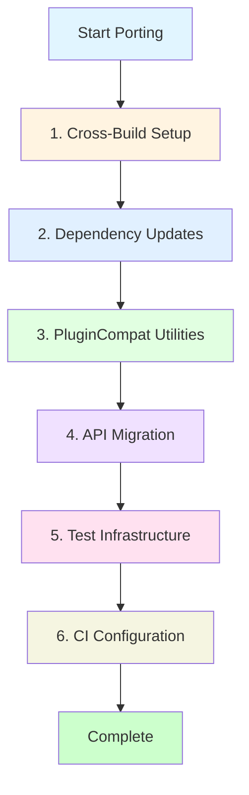

# General Strategy for Porting sbt Plugins to sbt 2.0

## Overview

This guide provides a general strategy for porting sbt plugins to support sbt 2.0, based on successful migrations of `sbt-mocha` and `sbt-less`. The strategy uses cross-building to support both sbt 1.x and sbt 2.0 from a single codebase.

## Core Strategy Phases



## Phase 1: Cross-Build Setup

### 1.1 Add Scala 3 to Cross-Build

```scala
lazy val scala212 = "2.12.20"
lazy val scala3 = "3.7.2"  // or latest stable

ThisBuild / crossScalaVersions := Seq(scala212, scala3)
```

### 1.2 Configure pluginCrossBuild

Map Scala versions to sbt versions:

```scala
ThisBuild / (pluginCrossBuild / sbtVersion) := {
  scalaBinaryVersion.value match {
    case "2.12" => "1.11.7"  // or latest sbt 1.x
    case _      => "2.0.0-RC7"  // or latest sbt 2.0
  }
}
```

### 1.3 Add Scala 2.12 Compatibility Options

Enable Scala 3 source compatibility for Scala 2.12:

```scala
scalacOptions := {
  CrossVersion.partialVersion(scalaVersion.value) match {
    case Some((2, major)) => Seq("-Xsource:3")
    case _                => Seq.empty
  }
}
```

## Phase 2: Dependency Updates

Update dependencies to sbt 2.0-compatible versions:

### Common Updates

- **sbt-web ecosystem**: Update to `1.6.0-M1` or later
- **sbt-js-engine**: Update to `1.4.0-M1` or later
- **sbt-web-build-base**: Update to `2.1.0-M1` or later (if used)

### Example

```scala
// Old
addSbtJsEngine("1.3.9")
addSbtWeb("1.5.8")

// New
addSbtJsEngine("1.4.0-M1")
addSbtWeb("1.6.0-M1")
```

## Phase 3: PluginCompat Utilities

**Note:** PluginCompat is **only for plugins in the sbt-web ecosystem**. If you're not using sbt-web, skip this phase.

### What is PluginCompat?

PluginCompat is a utility object provided by the **sbt-web** plugin (`com.typesafe.sbt.web.SbtWeb.PluginCompat`). It's **NOT** a separate plugin like `sbt-compat` - it's embedded within sbt-web to help sbt-web plugins work with both sbt 1.x and sbt 2.0.

### When to Use PluginCompat

**Use PluginCompat if:**
- Your plugin is in the sbt-web ecosystem (sbt-less, sbt-mocha, sbt-coffeescript, etc.)
- You need to handle `File` vs `FileRef` differences
- You have tasks that can't be serialized in sbt 2.0

**Skip PluginCompat if:**
- You're not in the sbt-web ecosystem
- Your plugin doesn't deal with file operations
- You're only targeting sbt 1.x

### Available Utilities

```scala
import com.typesafe.sbt.web.SbtWeb.PluginCompat

// 1. Wrap tasks that can't be serialized in sbt 2.0
val myTask = PluginCompat.uncached {
  Def.task {
    // Task implementation
    // This won't be cached in sbt 2.0
  }
}

// 2. Convert File to FileRef (sbt 2.0 uses FileRef in some APIs)
val file: File = new File("path/to/file")
val fileRef: FileRef = PluginCompat.toFileRef(file)

// 3. Convert FileRef back to File
val fileAgain: File = PluginCompat.toFile(fileRef)

// 4. Get FileConverter implicit (required in sbt 2.0)
implicit val fileConverter: FileConverter = PluginCompat.fileConverter
```

### PluginCompat vs sbt-compat

**Important:** PluginCompat and sbt-compat are **completely different**:

- **PluginCompat**: Utility in sbt-web for sbt 1.x ↔ 2.0 compatibility
- **sbt-compat**: Separate plugin for sbt 0.13 → sbt 1 compatibility

**They are NOT related** - sbt-compat is not used for sbt 2.0 porting. See `plugincompat-and-api-migration-explained.md` for details.

## Phase 4: API Migration

API Migration is the process of updating your plugin code to use APIs that work with both sbt 1.x and sbt 2.0. This is **separate from** PluginCompat and sbt-compat.

**Note:** API Migration is **NOT related to sbt-compat**. sbt-compat is for sbt 0.13 → sbt 1 compatibility, not sbt 2.0. For sbt 2.0 porting, you update APIs directly.

### 4.1 Common API Changes

| Old API (sbt 1.x) | New API (sbt 2.0) | Notes |
|-------------------|-------------------|-------|
| `inTask(task)(settings)` | `sbt.Project.inTask(task)(settings)` | Must fully qualify |
| `extraLoggers` | `extraAppenders` | Logging API change |
| `JsObject(...).toString()` | `JsObject(...).compactPrint` | JSON API change |
| `mapValues(f)` | `map { case (k, v) => k -> f(v) }.toMap` | Deprecation fix |

### Why These Changes?

These are **direct API changes** in sbt 2.0:
- Methods were renamed (`extraLoggers` → `extraAppenders`)
- Methods were moved (`inTask` → `Project.inTask`)
- Third-party libraries changed (`toString()` → `compactPrint` in spray-json)
- Deprecations were removed (`mapValues` removed in Scala 2.13+)

**No compatibility layer needed** - you just update your code to use the new APIs directly.

### 4.2 JSON API Migration

```scala
// Old
import spray.json._
val json = JsObject("key" -> JsString("value"))
val jsonString = json.toString()

// New
import spray.json._
import spray.json.DefaultJsonProtocol._  // May need this
val json = JsObject("key" -> JsString("value"))
val jsonString = json.compactPrint
```

### 4.3 Settings Composition

Modernize settings composition:

```scala
// Old style (still works, but less clear)
override def projectSettings = Seq(
  setting1 := value1,
  setting2 := value2
) ++ inTask(myTask)(
  taskSettings
)

// New style (clearer)
override def projectSettings = sbt.Def.settings(
  setting1 := value1,
  setting2 := value2,
  sbt.Project.inTask(myTask)(taskSettings)
)
```

## Phase 5: Test Infrastructure

### 5.1 Scripted Tests

**Use built-in scripted commands with globs:**

```bash
# ✅ Good: Use built-in commands
$ exists target/web/public/main/css/main.css
$ absent **/*.css
$ absent css/*.map

# ❌ Bad: Don't define custom checkAbsent in build.sbt
> checkAbsent css/main.css
```

### 5.2 Test Logger/Appender Migration

If your plugin has custom test infrastructure:

```scala
// Old (sbt 1.x)
class TestLogger extends Logger { ... }
extraLoggers := { ... }

// New (sbt 2.0)
class TestAppender extends Appender { ... }
extraAppenders := { ... }
```

### 5.3 Test Task Overrides

Ensure test task overrides work correctly:

```scala
// May need to override both test and executeTests
override def projectSettings = Seq(
  test := { ... },
  executeTests := { ... }
)
```

## Phase 6: CI Configuration

Add Scala 3 to your CI matrix:

```yaml
# Example GitHub Actions
strategy:
  matrix:
    scala: ["2.12.20", "3.7.2"]
    sbt: ["1.11.7", "2.0.0-RC7"]
```

Or use sbt's cross-building:

```bash
# Test both versions
+ test
```


## Tips, Tricks, and Hacks

### Tip 1: Start with Cross-Build First

Set up cross-building **before** making any code changes. This allows you to:
- See compilation errors for both versions
- Test incrementally
- Catch issues early

### Tip 2: Use `-Xsource:3` for Scala 2.12

This flag enables Scala 3 compatibility features in Scala 2.12, making cross-compilation easier:

```scala
scalacOptions := {
  CrossVersion.partialVersion(scalaVersion.value) match {
    case Some((2, _)) => Seq("-Xsource:3")
    case _            => Seq.empty
  }
}
```

### Tip 3: Leverage PluginCompat Utilities (sbt-web only)

**Only applies if you're in the sbt-web ecosystem!**

Don't reinvent the wheel. If you're in the sbt-web ecosystem, use `SbtWeb.PluginCompat` utilities:
- `uncached` - Wrap tasks that can't be serialized in sbt 2.0
- `toFileRef` / `toFile` - File/FileRef conversion helpers
- `fileConverter` - Implicit FileConverter for sbt 2.0

**Remember:** PluginCompat is **NOT** sbt-compat. They're completely different:
- PluginCompat: Utility in sbt-web for sbt 2.0 compatibility
- sbt-compat: Separate plugin for sbt 0.13 → sbt 1 compatibility (not used for sbt 2.0)

### Tip 4: Use Globs in Scripted Tests

**Avoid:** Defining custom commands like `checkAbsent` in every test's `build.sbt`

**Prefer:** Using built-in scripted commands with globs:

```bash
# Single command checks multiple files
$ absent **/*.css
$ absent **/*.map

# Instead of multiple custom commands
> checkAbsent css/main.css
> checkAbsent css/main.css.map
```

### Tip 5: BadCitizen Pattern - Accessing private[sbt] Types

**When to use:**
- Your plugin needs to access `private[sbt]` types (e.g., `SuiteResult`, `Tests.Output`)
- These types are only accessible from within the `sbt` package
- Your plugin code is in a different package (e.g., `com.typesafe.sbt.mocha`)

**The Problem:**
```scala
// Your plugin (in package com.typesafe.sbt.mocha)
package com.typesafe.sbt.mocha

import sbt._

// ❌ This won't compile - Tests.Output is private[sbt]
def reportResults(...): Tests.Output = {
  Tests.Output(...)  // Error: not accessible from this package
}
```

**How BadCitizen solves it:**
BadCitizen must be in the `sbt` package to access `private[sbt]` types, then exposes them to your plugin code:

```scala
// BadCitizen (in sbt package - CAN access private[sbt] types)
package sbt.mocha

import sbt.{SuiteResult, Tests}
import sbt.Tests.Summary
import sbt.protocol.testing.TestResult
import sbt.testing.Event

object BadCitizen {
  // Type alias exposes the private type
  type SuiteResult = sbt.SuiteResult

  // Forwarding method - just forwards to constructor (signatures are the same!)
  def output(
    overall: TestResult,
    events: Map[String, SuiteResult],
    summaries: Iterable[Summary]
  ): Tests.Output = {
    Tests.Output(overall, events, summaries)  // Just forwards the call
  }

  def suiteResult(results: Seq[Event]): SuiteResult = {
    SuiteResult(results)  // Just forwards the call
  }
}
```

**Usage in your plugin:**
```scala
// Your plugin (in package com.typesafe.sbt.mocha)
package com.typesafe.sbt.mocha

import sbt.mocha.BadCitizen

// ✅ Now you can use BadCitizen.SuiteResult and BadCitizen.output
def reportResults(...): Tests.Output = {
  BadCitizen.output(overall, events, summaries)
}
```

**Key points:**
- BadCitizen is NOT about bridging different signatures (they're the same!)
- BadCitizen IS about exposing `private[sbt]` types to code outside the `sbt` package
- BadCitizen must be in the `sbt` package (or a subpackage) to access private types
- The forwarding methods just call the constructors directly - no conversion needed

### Tip 6: JSON Format Implicits

If you use spray-json, you may need to fix format implicits:

```scala
// Old (may fail in Scala 3)
implicit val myFormat = jsonFormat3(MyCaseClass)

// New (explicit apply)
implicit val myFormat = jsonFormat3(MyCaseClass.apply)
```

### Tip 7: Test Incrementally

1. Get cross-build compiling (even if tests fail)
2. Fix API migrations one at a time
3. Update tests last
4. Test with both sbt versions frequently

### Tip 8: Check Dependency Compatibility

Before updating dependencies, check:
- Are they published for Scala 3?
- Do they support sbt 2.0?
- Are there milestone/RC versions available?

Use sbt's dependency resolution to verify:
```bash
> show update
```


### Tip 10: Settings Composition Best Practices

Use `sbt.Def.settings()` for clearer composition:

```scala
// Clear and readable
override def projectSettings = sbt.Def.settings(
  setting1 := value1,
  setting2 := value2,
  sbt.Project.inTask(myTask)(
    taskSetting1 := value1,
    taskSetting2 := value2
  )
)
```

### Hack 1: Conditional Compilation (Advanced)

If you absolutely need different code for sbt 1.x vs 2.0:

```scala
import sbt.util.Level

val mySetting = Def.setting {
  // Check sbt version at runtime
  if (sbtVersion.value.startsWith("2.")) {
    // sbt 2.0 code
  } else {
    // sbt 1.x code
  }
}
```

**Note:** Prefer BadCitizen pattern over conditional compilation when possible.

### Hack 2: Source-Specific Directories

For test code that needs different implementations:

```
project/
  src/
    main/
      scala-sbt-1.0/
        Compat.scala  # sbt 1.x specific
      scala-sbt-2.0/
        Compat.scala  # sbt 2.0 specific
```

**Note:** This is what the AI did for `sbt-less`, but it's better to use BadCitizen or PluginCompat when possible.

## Common Pitfalls

### Pitfall 1: Forgetting `-Xsource:3`

Without this flag, Scala 2.12 may not compile code that's compatible with Scala 3.

### Pitfall 2: Not Testing Both Versions

Always test with both sbt 1.x and sbt 2.0. Don't assume compatibility.

### Pitfall 3: Custom Scripted Commands

Avoid defining custom commands in test `build.sbt` files. Use built-in scripted commands with globs instead.

### Pitfall 4: Missing Dependency Updates

Some dependencies may need updates even if they're not direct dependencies. Check transitive dependencies.

### Pitfall 5: Ignoring Deprecation Warnings

Address deprecation warnings early. They often indicate APIs that will be removed.

## Summary Checklist

- [ ] Assess plugin complexity (simple vs complex)
- [ ] Set up cross-build (Scala 2.12 + 3.x)
- [ ] Configure `pluginCrossBuild` mapping
- [ ] Add `-Xsource:3` for Scala 2.12
- [ ] Update dependencies to sbt 2.0-compatible versions
- [ ] Implement BadCitizen pattern (if accessing private[sbt] types)
- [ ] Use PluginCompat utilities (if in sbt-web ecosystem)
- [ ] Migrate API calls (`inTask`, JSON, etc.)
- [ ] Fix deprecation warnings
- [ ] Update test infrastructure
- [ ] Use globs in scripted tests (not custom commands)
- [ ] Update CI to test both versions
- [ ] Test thoroughly with both sbt 1.x and 2.0

## Key Insight

The goal is to support both sbt 1.x and sbt 2.0 from a **single codebase** using cross-building and compatibility bridges. This is more maintainable than maintaining separate branches or codebases.

